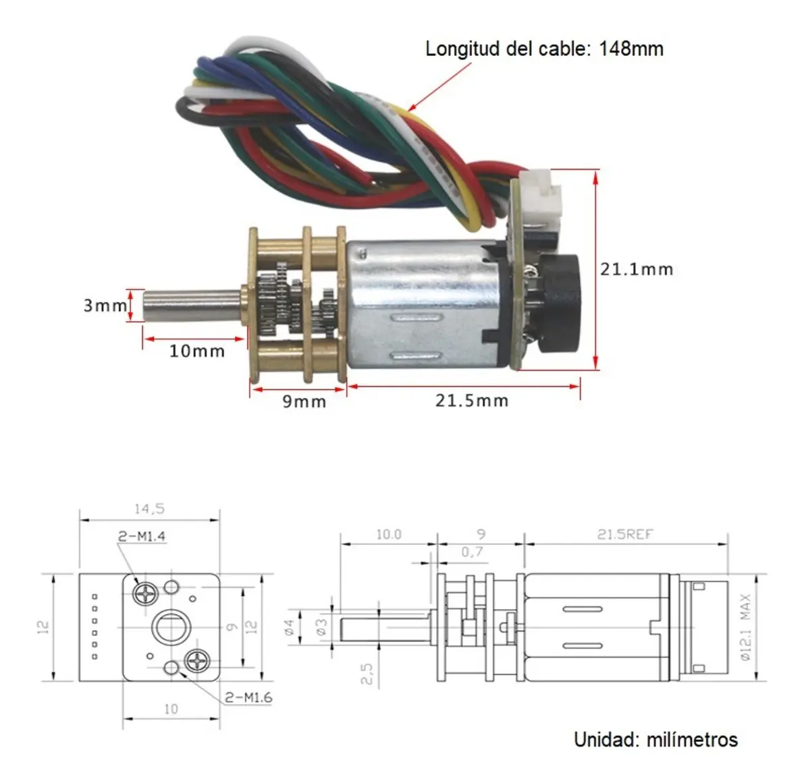
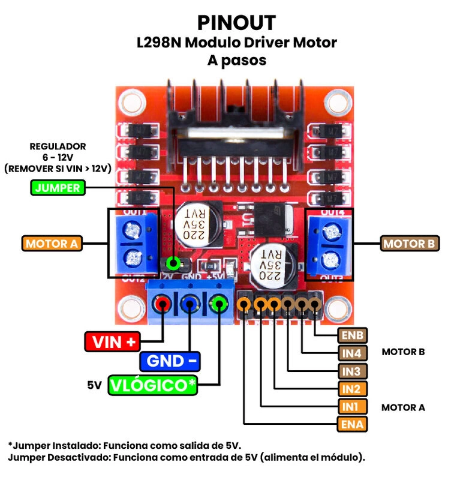

# mano_iafh

Control para la mano diseñanda por Irving Aarón Flores Hernández

## Componentes

- Voltaje Nominal: 6VDC
- Corriente Pico: 0.55A

Cables:
* Rojo: Potencia del motor (+), puede invertir polaridad para cambiar dirección de giro.
* Negro: Fuente de alimentación del motor (-) : Puede controlar e invertir el giro en un sentido horario o antihorario.
* Amarillo: Potencia del encoder (+)
* Verde: Potencia del encoder (-) : no invierta la polaridad, trabaja en un rango de 3,3~5V
* Azul: A retroalimentación de la señal: 7 señales por giro
* Blanco: B retroalimentación de la señal: 7 señales por giro

[Fuente: Mercado Libre SanDoRobotics](https://articulo.mercadolibre.com.mx/MLM-1905259867-micro-motorreductor-con-encoder-compatible-6vdc-electronica-_JM?matt_tool=28238160&utm_source=google_shopping&utm_medium=organic)

